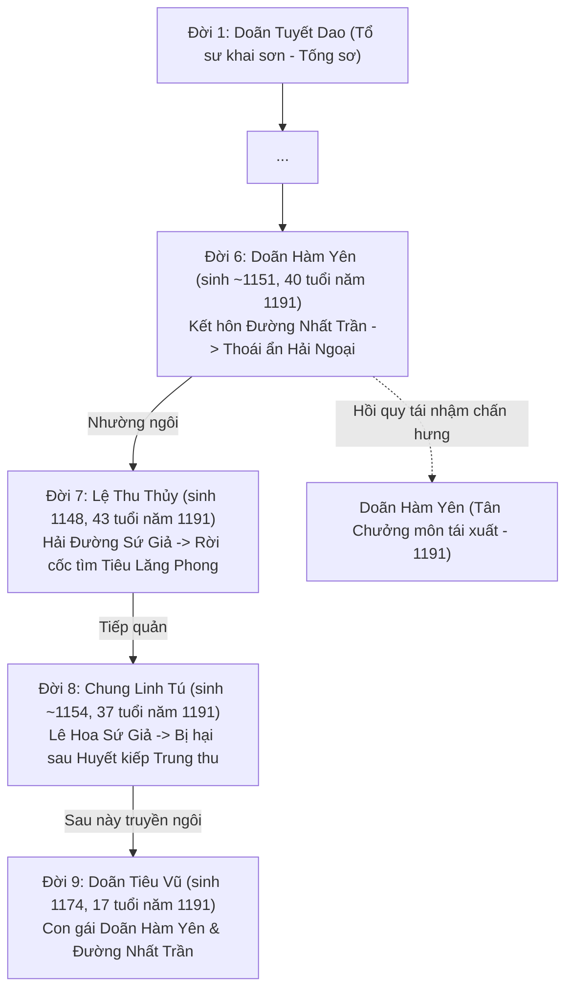
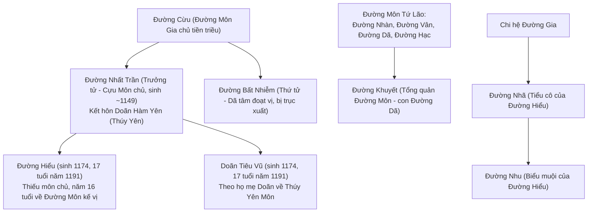
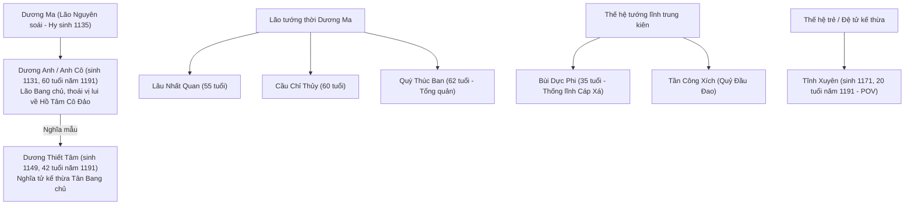
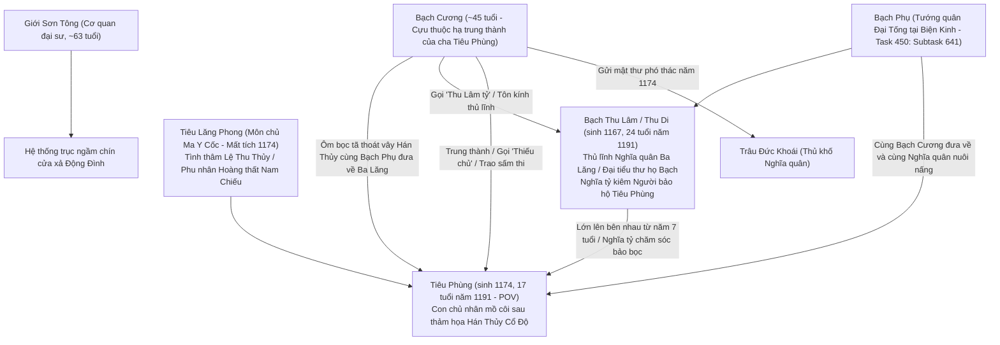

# SỔ CÁI PHẢ HỆ & BỐI PHẬN GIANG HỒ (GENEALOGY & PEDIGREE MATRIX)

> **Mục đích:** Khóa chặt 100% cây phả hệ, thế hệ truyền thừa, quan hệ hôn nhân, huyết thống, sư đồ và tuổi tác sinh học của tất cả nhân vật trong 12 đại môn phái và các thế lực giang hồ.  
> **Kỷ luật cốt lõi:** Tuyệt đối cấm sáng tác hay gán tuổi NPC theo cảm tính. Tuân thủ nghiêm ngặt **Công thức Tuổi Sinh Học (Biological Age Sanity Formula)**:
> $$\text{Tuổi Cha/Mẹ} \ge \text{Tuổi Con Trưởng} + 16 \text{ đến } 22 \text{ tuổi}$$
> Bất kỳ mâu thuẫn nào về thế hệ hoặc bối phận đều bị coi là vi phạm nghiêm trọng quy chuẩn Temporal Continuity (Rule TC-1).

---

## 1. NGUYÊN TẮC KIỂM ĐỊNH PHẢ HỆ (PEDIGREE SANITY RULES)

1. **Rule PED-1 (Kinship Provenance Check):** Trước khi đưa bất kỳ NPC nào vào Chapter Brief, bắt buộc phải tra cứu nguồn gốc SQLite `story_database.sqlite3` và lore chính thống Kingsoft để xác định:
   - NPC là con của ai? Cha mẹ là ai?
   - Phu quân / Thê tử là ai? Đã có con chưa? Con bao nhiêu tuổi trong năm diễn biến truyện?
   - Thuộc thế hệ truyền thừa thứ mấy của môn phái?
2. **Rule PED-2 (Biological Age Sanity):**
   - Nếu NPC đã có con ở độ tuổi thiếu niên ($16 - 18$ tuổi), tuổi của NPC đó trong mốc thời gian tối thiểu phải từ **$36 - 42$ tuổi**.
   - Tuyệt đối cấm gán nhãn "mới ngoài đôi mươi", "trẻ tuổi non dạ" cho nhân vật đã có con trưởng thành.
3. **Rule PED-3 (Generational Hierarchy & Addressing):**
   - **Đồng bối (cùng thế hệ):** Sư huynh / Sư đệ / Sư tỷ / Sư muội.
   - **Bề trên (cách 1 thế hệ):** Sư bá (lớn hơn sư phụ), Sư thúc (nhỏ hơn sư phụ), Sư phụ, Chưởng môn.
   - **Bề trên (cách 2 thế hệ):** Sư tổ, Thái thượng trưởng lão.
   - **Vãn bối xưng hô với Tiền bối:** Xưng "Đệ tử" hoặc "Con", gọi "Chưởng môn", "Sư bá", "Sư thúc". Cấm tuyệt đối đệ tử gọi cựu môn chủ đời trước là "sư tỷ" như bạn lứa ngang hàng.

---

## 2. PHẢ HỆ THÚY YÊN MÔN (BÁCH HOA CỐC - ĐIỀN TRÌ)

### A. Cây Truyền Thừa Chưởng Môn (Môn Chủ Các Đời)

### B. Bảng Bối Phận & Niên Đại Chi Tiết (Năm 1191)

| Nhân Vật | Thế Hệ / Bối Phận | Năm Sinh | Tuổi (1191) | Quan Hệ Gia Đình / Huyết Thống | Vị Thế & Quan Hệ Môn Phái |
| :--- | :---: | :---: | :---: | :--- | :--- |
| **Lệ Thu Thủy** | Đời 7 (Thất đại) | **1148** (Mậu Thìn) | **43 tuổi** | Tình nhân Tiêu Lăng Phong (chia ly 1174) | **Sư tỷ** của Doãn Hàm Yên và Chung Linh Tú; cựu Môn chủ. |
| **Doãn Hàm Yên** | Đời 6 (Lục đại) | **1151** (Tân Mùi) | **40 tuổi** | Phu nhân Đường Nhất Trần; **Thân mẫu của Doãn Tiêu Vũ (17 tuổi) và Đường Hiểu (17 tuổi)** | **Sư muội Lệ Thu Thủy, Sư tỷ Chung Linh Tú**; Lục Đại Môn Chủ tái nhậm chấn hưng. |
| **Chung Linh Tú** | Đời 8 (Bát đại) | **1154** (Giáp Tuất) | **37 tuổi** | Độc thân | **Sư muội của Lệ Thu Thủy và Doãn Hàm Yên**; Bát Đại Môn Chủ. |
| **Hạ Thịnh** | Trưởng lão | ~1138 | ~53 tuổi | Trưởng lão Hạ Hoa Viên | Bậc sư thúc tổ / tiền bối chấp chính. |
| **Đông Hoài** | Trưởng lão | ~1140 | ~51 tuổi | Trưởng lão Đông Hoa Viên | Bậc sư thúc tổ / tiền bối chấp chính. |
| **Doãn Tiêu Vũ** | Đời 9 (Cửu đại) | **1174** (Giáp Ngọ) | **17 tuổi** | **Con gái Doãn Hàm Yên & Đường Nhất Trần**; muội muội Đường Hiểu | Đệ tử kiệt xuất Thúy Yên, trạc tuổi Hạ Nương (16 tuổi); tương lai Môn chủ đời 9. |
| **Đan Bích Tú** | Đệ tử Chấp pháp | **1168** (Mậu Tý) | **23 tuổi** | Thuộc chi hệ Chấp pháp đường | Sư tỷ gác cổng Bách Hoa Cốc, dẫn dắt thế hệ đàn em. |
| **Hạ Nương** | Y nữ Dược phòng | **1175** (Ất Mùi) | **16 tuổi** | Con gái y quán thảo dược Đại Lý | Môn hạ vãn bối (gọi Lệ Thu Thủy là Sư bá, Doãn Hàm Yên là Chưởng môn). |
| **Tiểu Đào** | Đệ tử tuần sơn | **1177** (Đinh Dậu) | **14 tuổi** | Đệ tử sơ cấp Dược phòng | Sư muội của Hạ Nương. |

---

## 3. PHẢ HỆ ĐƯỜNG MÔN (XUYÊN THỤC ĐƯỜNG GIA BẢO)

### A. Cây Huyết Thống Đường Gia

### B. Bảng Bối Phận & Niên Đại Chi Tiết (Năm 1191)

| Nhân Vật | Thế Hệ / Chi Nhánh | Năm Sinh | Tuổi (1191) | Quan Hệ Gia Đình / Huyết Thống | Vị Thế Trong Đường Môn |
| :--- | :---: | :---: | :---: | :--- | :--- |
| **Đường Hạc** | Tứ Lão tiền bối | ~1132 | ~59 tuổi | Bạch Bào Tẩu, sư phụ Đường Nhất Trần | Trưởng lão tối cao đức cao vọng trọng. |
| **Đường Nhất Trần** | Trực hệ Trưởng chi | **1149** (Kỷ Tỵ) | **42 tuổi** | **Phu quân Doãn Hàm Yên; Phụ thân của Đường Hiểu và Doãn Tiêu Vũ** | Cựu Môn chủ Đường Môn danh chấn thiên hạ; bôn ba hải ngoại trở về. |
| **Đường Khuyết** | Chi hệ Tuyệt Xuân Tẩu | **1157** (Đinh Tỵ) | **34 tuổi** | Con trai Tuyệt Xuân Tẩu Đường Dã | Tổng quản Đường Môn đương thời; có dã tâm nhưng tài cán xuất chúng. |
| **Đường Hiểu** | Trực hệ Đời sau | **1174** (Giáp Ngọ) | **17 tuổi** | **Trưởng tử của Đường Nhất Trần & Doãn Hàm Yên**; huynh trưởng Doãn Tiêu Vũ | Thiếu môn chủ Đường Môn; năm 16 tuổi (1190) hồi môn đấu võ đoạt vị gia chủ. |
| **Đường Nhã** | Chi hệ phân đà | ~1155 | ~36 tuổi | Cháu họ xa Đường Nhất Trần; Tiểu cô của Đường Hiểu | Nữ nhân vật then chốt quản lý Biệt Nhã Tiểu Trúc. |
| **Đường Nhu** | Chi hệ phân đà | **1176** (Bính Thân) | **15 tuổi** | Con gái Đường Nhã; Biểu muội của Đường Hiểu | Thiếu nữ ngây thơ đáng yêu tại Biệt Nhã Tiểu Trúc. |

---

## 4. PHẢ HỆ THIÊN VƯƠNG BANG (THANH LOA ĐẢO - ĐỘNG ĐÌNH HỒ)

### A. Cây Kế Thừa Soái Hạm Thiên Vương

### B. Bảng Bối Phận & Niên Đại Chi Tiết (Năm 1191)

| Nhân Vật | Bối Phận / Chức Vị | Năm Sinh | Tuổi (1191) | Quan Hệ Thân Tộc / Sư Đồ | Vị Thế Hiện Tại |
| :--- | :---: | :---: | :---: | :--- | :--- |
| **Dương Anh (Anh Cô)** | Lão Bang chủ (Đời 2) | **1131** (Tân Hợi) | **60 tuổi** | Con gái Dương Ma; nghĩa mẫu Dương Thiết Tâm | Lãnh tụ tinh thần tối cao; thoái vị lui về Hồ Tâm Cô Đảo tháng 8/1191. |
| **Cầu Chỉ Thủy** | Cựu Trưởng lão | **1131** (Tân Hợi) | **60 tuổi** | Bạn tri giao đồng niên với Dương Anh | Bị vu oan thông Kim, được bảo lãnh sang Cái Bang lánh nạn. |
| **Lâu Nhất Quan** | Trưởng lão Tiền phong | **1136** (Bính Thìn) | **55 tuổi** | Lão tướng dưới trướng Dương Ma | Mang huyết thù sâu nặng với triều đình Nam Tống; bảo thủ cương trực. |
| **Quý Thúc Ban** | Tổng quản sự vụ | **1129** (Kỷ Dậu) | **62 tuổi** | Túc tướng trung thành phò tá Dương Anh | Điều phối quân nhu, thuyền bè và nghi lễ chuyển giao soái vị. |
| **Dương Thiết Tâm** | Tân Bang chủ (Đời 3) | **1149** (Kỷ Tỵ) | **42 tuổi** | Nghĩa tử Dương Anh; dòng dõi Dương gia tướng | Tân Bang chủ thống lĩnh toàn bang sau đại tỷ võ tháng 8/1191. |
| **Bùi Dực Phi** | Thống lĩnh Cáp Xá | **1156** (Bính Thân) | **35 tuổi** | Tướng lĩnh thân cận dưới quyền Dương Anh | Dẫn 30 thiết kỵ xuất phát sang Thúy Yên Môn hỗ trợ quân nhu. |
| **Diệp Mẫu** | Thân mẫu Tĩnh Xuyên | **1150** (Canh Dần) | **41 tuổi** | Mẫu thân Tĩnh Xuyên; góa phụ nghĩa sĩ Trường Giang | Mù lòa hai mắt, sống tại lều nứa bờ tây Thanh Loa Đảo. |
| **Tĩnh Xuyên** | Đệ tử thiết kỵ (POV) | **1171** (Tân Mão) | **20 tuổi** | Con trai Diệp Mẫu; đàn em Bùi Dực Phi | Nhân vật chính POV; trải qua huyết chiến Hình Thiên Lĩnh nhận mặt nạ sắt. |

---

## 5. PHẢ HỆ NGHĨA QUÂN BA LĂNG HUYỆN & MA Y CỐC

### A. Cây Huyết Thống & Kế Thừa Nghĩa Quân

### B. Bảng Bối Phận & Niên Đại Chi Tiết (Năm 1191)

| Nhân Vật | Bối Phận / Chức Vị | Năm Sinh | Tuổi (1191) | Quan Hệ Thân Tộc / Sư Đồ (Direct Source Verified) | Vị Thế Hiện Tại |
| :--- | :---: | :---: | :---: | :--- | :--- |
| **Bạch Phụ** | Tướng quân Đại Tống | Tiền triều | Đã khuất / Sa trường | **Thân phụ của Bạch Thu Lâm** (`Task 450: Subtask 641`); cùng Bạch Cương đưa Tiêu Phùng về Ba Lăng | Tướng quân trấn thủ Biện Kinh sau gia nhập nghĩa quân; cùng Bạch Cương che chở nuôi nấng Tiêu Phùng thời sơ khai. |
| **Bạch Thu Lâm (Thu Di)** | Thủ lĩnh Nghĩa quân | **1167** (Đinh Hợi) | **24 tuổi** | Con gái Tướng quân Bạch Phụ; **Nghĩa tỷ kiêm Người bảo hộ Tiêu Phùng** | Nữ thủ lĩnh Ba Lăng Huyện; từ năm 7 tuổi đã cùng cha và Bạch Cương chăm sóc bón cháo cho Tiêu Phùng. |
| **Bạch Cương** | Tiền bối Nghĩa quân | ~**1146** | ~**45 tuổi** | **Cựu thuộc hạ của cha Tiêu Phùng; người ôm bọc tã Tiêu Phùng vượt vây Hán Thủy cùng Bạch Phụ đưa về Ba Lăng nuôi nấng** (`baijiang.lua`, Task 157) | Bị trọng thương Âm kình tại Tuyệt Vấn Pha; gọi Tiêu Phùng là 'thiếu chủ', trao mảnh trục cuốn sấm thi. |
| **Trâu Đức Khoái** | Thủ khố Nghĩa quân | ~**1140** | ~**51 tuổi** | Bạn thâm giao của Bạch Cương ('Đức Khoái huynh') (`baijiang.lua`) | Cất giấu chiếc tráp da trâu và bức thư máu tại kho tiền trang Ba Lăng suốt 17 năm. |
| **Giới Sơn Tông** | Tiền bối Ma Y Cốc | **1128** (Mậu Thìn) | **63 tuổi** | Cơ quan đại sư; bạn vong niên Tiêu Lăng Phong; gọi Tiêu Phùng là 'thiếu chủ' | Bị tra tấn tàn tật hai gót chân, ngồi xe lăn chế tạo cơ quan xả lũ. |
| **Tiêu Phùng** | Thiếu hiệp Nghĩa quân (POV) | **1174** (Giáp Ngọ) | **17 tuổi** | Con trai Tiêu Lăng Phong; được Bạch Cương, Bạch Phụ và Thu Di cưu mang | Nhân vật chính POV; trải qua đại hồng thủy và phục kích bến đò Giang Tân. |
| **Thẩm Thiết Thạch** | Nghĩa sĩ độc hành | **1159** (Kỷ Mão) | **32 tuổi** | Đệ đệ Thẩm Hà Diệp; nghĩa quân Tương Dương cựu trào | Bị hàn độc chưởng lực giặc Kim nhập não, tịnh dưỡng tại bãi sậy Ba Lăng. |
| **Thẩm Hà Diệp** | Chủ tiệm phòng cụ | **1155** (Ất Mùi) | **36 tuổi** | Tỷ tỷ Thẩm Thiết Thạch; con quan Binh bộ tiền triều | May đo giáp da kiêm sơ cứu trật đả; coi Tiêu Phùng như đệ đệ trong nhà. |

---

## 6. PHẢ HỆ CÁC THẾ LỰC LIÊN QUAN

### A. Đại Lý Đoàn Thị
- **Đoàn Trí Hưng (Đoàn Hoàng Gia):** Sinh ~1146, khoảng **45 tuổi** năm 1191. Quốc vương Đại Lý, võ công Nhất Dương Chỉ danh chấn thiên hạ, cải trang dự dạ yến Thúy Yên Môn (`Task 12: Subtask 94–95`).

### B. Ngũ Độc Giáo (Miêu Cương)
- **Hồ Hiến Cơ:** Giáo chủ Ngũ Độc Giáo, cấu kết Tây Hạ mưu đồ khuynh đảo Trung Nguyên.
- **Lư Tiếu Bần:** Sinh **1158 (Mậu Dần) — 33 tuổi**, Bạch Kỳ Chủ Ngũ Độc Giáo, tuyệt kỹ Diệu Thủ Không Không; thức thời, trọng nghĩa khí hơn giáo lệnh.

### C. Triều Đình Nam Tống & Quan Lại Lịch Sử
- **Hàn Thác Trụ:** Sinh **1152 (Nhâm Thân) — 39 tuổi**, Tuyên phủ sứ Nam Tống, cháu họ Ngô Thái Hậu, phái chủ chiến mang mật chiếu Tống Hiếu Tông giải cứu giang sơn.
- **Triệu Nhữ Ngu:** Tể phụ đại thần Nam Tống, người ủy thác bảo vệ Hàn Thác Trụ.
- **Ngô Hy:** Sinh ~1162 (~29 tuổi năm 1191), Tứ Xuyên Tuyên Phủ Phó Sứ, thống soái Ngô Gia Quân, kẻ có dã tâm xưng vương Tây Thục.

---

## 7. MẠNG LƯỚI QUAN HỆ HỮU CƠ GIỮA CÁC NPC VỚI PROTAGONIST TRIO (CONVERGENCE MATRIX)

| Protagonist (Trio) | NPC Trọng Yếu | Mối Quan Hệ Trong Novel (Hợp Lý Hóa Theo Direct Source) | Điểm Chạm Cốt Truyện / Giao Lưu Liên Tuyến |
| :--- | :--- | :--- | :--- |
| **Tiêu Phùng** (17t, Ba Lăng) | **Bạch Thu Lâm** (24t) | Nghĩa tỷ kiêm Người bảo hộ / Thủ lĩnh. Đưa chàng về Ba Lăng sau trận Hán Thủy, bảo bọc, dạy dỗ chàng. Chàng gọi nàng là "Thu Di" theo thói quen nghĩa quân. | Trao khánh bạc, giải mã Vô Danh Mật Tịch, chuẩn bị gửi Tiêu Phùng sang Cái Bang bái kiến Thạch Hiên Viên. |
| **Tiêu Phùng** (17t, Ba Lăng) | **Bạch Cương** (~45t) | Cựu thuộc hạ trung thành của cha. Bạch Cương gọi Tiêu Phùng là "thiếu chủ", xưng đệ với Bạch Thu Lâm ("Thu Lâm tỷ"). | Trao mảnh trục cuốn sấm thi tại Tuyệt Vấn Pha, khẳng định thân thế oai hùng của Tiêu Lăng Phong. |
| **Tiêu Phùng** (17t, Ba Lăng) | **Trâu Đức Khoái** & Bô lão | Thủ khố nghĩa quân và các bô lão (Long Ngũ, Điềm Tửu, Bất Động, Thẩm Hà Diệp). | Giữ bức mật thư máu 17 năm, rèn luyện Tiêu Phùng từ đứa trẻ xóm chài thành hiệp sĩ. |
| **Tĩnh Xuyên** (18t, Thanh Loa) | **Dương Thiết Tâm** (42t) | Tân Bang chủ Thiên Vương Bang (nghĩa tử Dương Anh). Người khảo hạch và chỉ điểm thương pháp. | Trận đại tỷ võ Chương 02a, 02b; giao trọng trách phá vây Hình Thiên Lĩnh (Chương 07a, 07b, 10). |
| **Tĩnh Xuyên** (18t, Thanh Loa) | **Bùi Dực Phi** (35t) | Cáp Xá thống lĩnh tình báo, Thống lĩnh trực tiếp (Mentor / Commander) của Tĩnh Xuyên. | Dẫn 30 kỵ binh sang Thúy Yên Môn hỗ trợ Du Long Giác $\rightarrow$ Móc xích kết nối tuyến Tĩnh Xuyên và Hạ Nương. |
| **Tĩnh Xuyên** (18t, Thanh Loa) | **Cầu Chỉ Thủy** (60t) | Cựu Trưởng lão Thiên Vương Bang (gốc Cái Bang) bị vu oan. | Tĩnh Xuyên đối chất trong thạch ngục, bóc trần âm mưu Nhất Phẩm Đường; Cầu Chỉ Thủy sang Cái Bang. |
| **Hạ Nương** (16t, Bách Hoa) | **Doãn Hàm Yên** (40t) | Lục Đại Môn Chủ Thúy Yên Môn (vợ Đường Nhất Trần, mẹ Doãn Tiêu Vũ 17t). Vị Chưởng môn thực tế, gánh vác kinh tài. | Trao áo choàng lông cáo, giao mật lệnh giám sát Lệ Thu Thủy, cử leo vách đá tìm dược liệu giải độc Mị Mị Hương. |
| **Hạ Nương** (16t, Bách Hoa) | **Lệ Thu Thủy** (43t) | Ngũ Đại Môn Chủ (Tiền Chưởng môn), sư tỷ Doãn Hàm Yên. Mang tâm bệnh do hung ngọc Du Long Giác và mối tình 17 năm trước. | Hạ Nương dùng y lý thực chứng giải phẫu vết thương sói, nhìn thấu sự biến chuyển tâm thần của cựu môn chủ. |
| **Hạ Nương** (16t, Bách Hoa) | **Đan Bích Tú** (19t) | Đồng môn sư tỷ chấp pháp. | Kề vai tác chiến tại cửa trận Bách Hoa; được Hạ Nương châm kim rịt thuốc cầm máu. |

